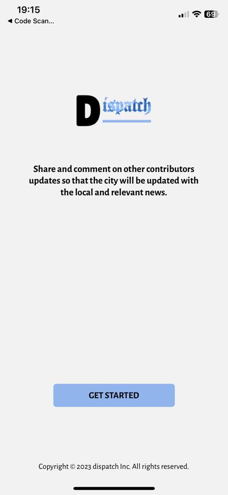
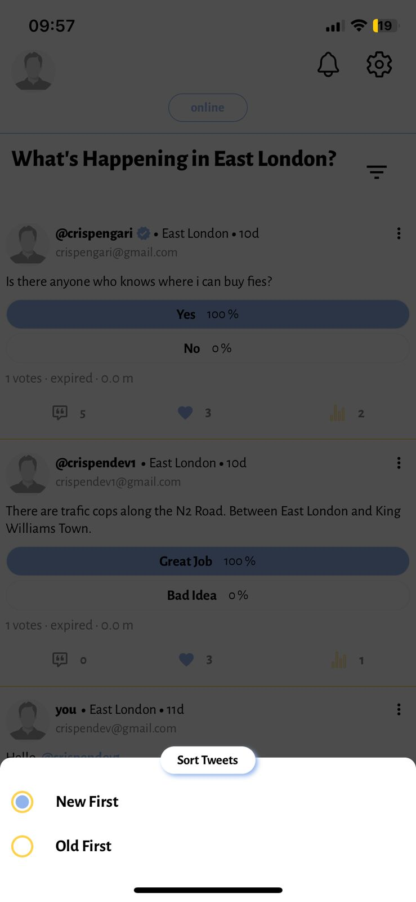
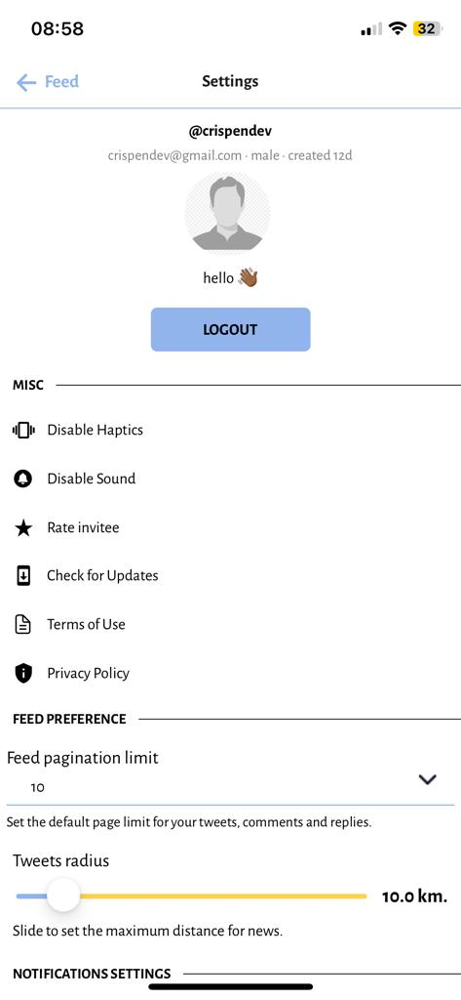

### dispatch

This is a simple mobile app for local news dispatch based on user's location radius.

<p align="center"></p>

### Idea

The idea behind dispatch app is very simple. Users of the app will be able to recieve notifications or feed post known as `tweets`. These tweets can be created by any user and the user that are in that location radius can read these tweets. During tweet creation users are also able to set tweet `polls` which allows other users to interact with their tweets by voting. Sample code:

```ts
// extracted: packages/api/src/context/context.ts

import { CreateFastifyContextOptions } from "@trpc/server/adapters/fastify";
import { inferAsyncReturnType } from "@trpc/server";
import { prisma } from "../prisma";
import Redis from "ioredis";
import { verifyJwt } from "../utils/jwt";
import { User } from "@prisma/client";

const getMe = async (jwt: string | undefined): Promise<User | null> => {
  if (!!!jwt) return null;
  try {
    const { id } = await verifyJwt(jwt);
    const me = await prisma.user.findFirst({ where: { id } });
    return me;
  } catch (error) {
    return null;
  }
};
export const createContext = async ({
  req,
  res,
}: CreateFastifyContextOptions) => {
  const redis = new Redis({
    host: process.env.REDIS_HOST,
  });
  const jwt = req.headers.authorization?.split(/\s/)[1];
  const me = await getMe(jwt);
  return {
    req,
    res,
    prisma,
    redis,
    me,
  };
};
export type CtxType = inferAsyncReturnType<typeof createContext>;
```

Other users that are not the creator of the tweets can interact with tweets by doing the following:

1. `liking`
2. `viewing`
3. `polling`
4. `commenting`

For all the comments users are able to respond or reply to comments on each `tweet` also mention users on the `comments` and `replies`. Users can also react to comments and `replies` to improve user interactivity.

### Implementation

Building a news dispatching app using `tRPC` using the mono-repo approach with `yarn-workspaces`. The following packages build app the whole system.

1. `api` - this package is the brain, and storage of the `dispatch` startup.
2. `mobile` - this package is a mobile app that consumes the `trpc` api.
3. `shared` - this package contains shared utility functions between other packages.

### How is dispatch different from twitter (X)?

> Problem statement: `Twitter is a great platform for news feed globally. As a well known platform although there are algorithms that caters for feeding users with "tweets of interest" it lacks filtering based on location.`

- Dispatch was build to solve the problems of:
  1. tweets filtering based on location radius (get only news within your city).
  2. notify all users that are using the app about new topics in the city.

### Authentication

The authentication flow of the app start on the landing screen.

<p align="center">
    
    
</p>

Users of the app can be able to:

1. Register

> To register as a dispatch user you are required to register using a unique `nickname` and `email` to those other users that are in the `dispatch` database. A `password` that contains at least `8` characters with at least `1` digit is required and to to confirmed for successful registration.

- If there are no registration errors you will receive the email that **requires you to click the link using the phone that you are using to create an account with otherwise you wont be able to register when the device that you are registering with and the device that you are clicking the email from are different.** This is protected on the server as for each and every `trpc` (except for subscriptions) request we require an `authorization` header that contains a `jwt` token that helps us to verify your email.

<p align="center">
    
    
</p>

2. Update Profile

   > After clicking the link to verify your email you will be able to get verified and you will prompted to update your profile `biography` and `gender`.

   <p align="center">
       
   </p>

3. Login

> Login in the app requires you to have valid credentials `nickname` or `email` and a valid password.

<p align="center">
    
</p>

4. Request Forgot password

> If you forgot your password you can be able to reset it using your `email`. **You will also be required to click the link from your email using the device that you are trying to perform this action from.**

<p align="center">
    
</p>

5. Reset Password

<p align="center">
    
</p>

> When you click the link from the `email` you will be able to change your password to a new password and login with new credentials.

### App

In the app there are a lot of actions that can be done which are:

0. Feed
   When you are authenticated you will be able to see the tweets feeds and you will be able to sort them in the order you prefer. Note that these tweet feeds are based on your location on the dispatch app.

<p align="center">
    
    
    
</p>

1. Tweet

   > A tweet is a news item in the context of this app. Authenticated users can be able to:

   <p align="center">
      
      
       
       
       
       
   </p>

   - Create
   - View
   - Delete Tweet
   - See Tweets Likes
   - Comment on tweet
   - Reply to tweet comments
   - Delete comments and Replies

2. Notifications

   > Users are able to see their notifications and manage them.

   <p align="center">
      
      
     
   </p>

3. Profile
   > Authenticated users will be able to view their profile.

- View your profile
- View Other user's profile

  <p align="center">
      
      
   </p>

4. Settings

   > Users will be able to see your settings and manage them.

     <p align="center">
      
      
      
      
      
      
      
      
   </p>

5. Terms of use

   > Terms of Use of the app can be accessed with both authenticated or unauthenticated user in the Settings and Landing Screens respectively.

<p align="center">
    
  
</p>

6. Privacy Policy.
   > Privacy policy of the app can be accessed with both authenticated or unauthenticated user in the Settings and Landing Screens respectively.
   <p align="center">
       

</p>

You can see the whole app in action by testing it locally but first you are required to have the following installed in your computer:

1. PostgreSQL - database
2. Ngrok - for forwarding request
3. Redis - for caching

Open the project in the first terminal and navigate to the `packages/shared` by running the following command:

```shell
cd packages/shared
```

Then run:

```shell
yarn
```

Open the project in the 2nd terminal and navigate to the `packages/api` by running the following command:

```shell
cd packages/api
```

Then run:

```shell
yarn
```

To start the server make sure your redis and postgres server are running and then run:

```shell
yarn start
```

> Now it's time for you to start the application and run it on an emulator or a physical device. Open engrok and forward all request on port `3001` and copy the domain of the forwaded url and locate the file `packages/mobile/src/constants/index.ts` and change the domain to the value that you copied:

```ts
// example
export const domain: string = "c6e3-213-172-134-10.ngrok-free.app";
```

Open the project in the 3rd terminal and navigate to the `packages/mobile` by running the following command:

```shell
cd packages/mobile
```

Then run:

```shell
yarn
```

To test the mobile application on an emulator run the command:

```shell
yarn start
```

> Scan the `QR` code with your phone or you can run on emulator if the emulator is installed in your computer.

### LICENSE

This project is under the `MIT` license which reads as follows:

```shell
MIT License

Copyright (c) 2023 crispengari

Permission is hereby granted, free of charge, to any person obtaining a copy
of this software and associated documentation files (the "Software"), to deal
in the Software without restriction, including without limitation the rights
to use, copy, modify, merge, publish, distribute, sublicense, and/or sell
copies of the Software, and to permit persons to whom the Software is
furnished to do so, subject to the following conditions:

The above copyright notice and this permission notice shall be included in all
copies or substantial portions of the Software.

THE SOFTWARE IS PROVIDED "AS IS", WITHOUT WARRANTY OF ANY KIND, EXPRESS OR
IMPLIED, INCLUDING BUT NOT LIMITED TO THE WARRANTIES OF MERCHANTABILITY,
FITNESS FOR A PARTICULAR PURPOSE AND NONINFRINGEMENT. IN NO EVENT SHALL THE
AUTHORS OR COPYRIGHT HOLDERS BE LIABLE FOR ANY CLAIM, DAMAGES OR OTHER
LIABILITY, WHETHER IN AN ACTION OF CONTRACT, TORT OR OTHERWISE, ARISING FROM,
OUT OF OR IN CONNECTION WITH THE SOFTWARE OR THE USE OR OTHER DEALINGS IN THE
SOFTWARE.

```
